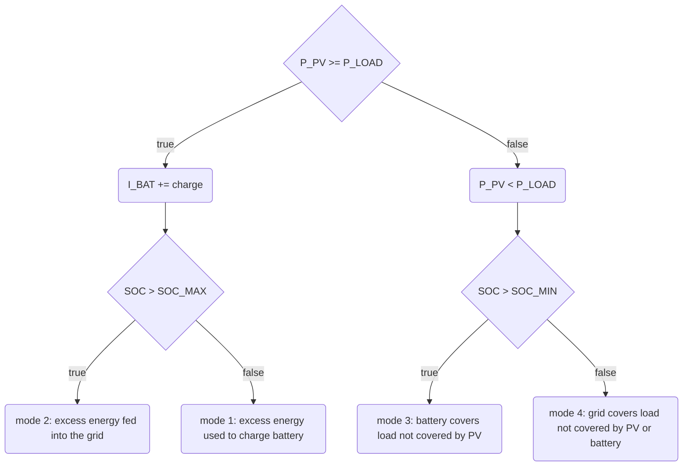

# Energy usage algorithm

This energy flow algorithm is losely based on the paper [An Energy Flow Management Algorithm for a Photovoltaic Solar Home, Fathia Chekired et al.](https://doi.org/10.1016/j.egypro.2017.03.256),
but has been extended to also cover load from PV and battery combined and
might be further extended in the future to also allow to use excess energy to
charge an electric vehicle.

The goal is that energy created by the PV is primarily used directly and excess
energy is first fed into the battery and only fed into the grid if the battery
is full. If the PV energy is not sufficient to cover the load, the battery will
be discharged and energy from the grid will only be consumed when the battery
is empty.

## Energy usage modes

These are the modes considered during the simulation of the energy usage of the
system. Based on which mode we're in, the energy used to cover the load is
consumed from different sources.

| Mode   | Battery state | Grid feed-in | Grid usage |
|--------|:-------------:|:------------:|:----------:|
| Mode 1 |    charging   |     false    |    false   |
| Mode 2 |      full     |     true     |    false   |
| Mode 3 |  discharging  |     false    |    false   |
| Mode 4 |     empty     |     false    |    true    |

